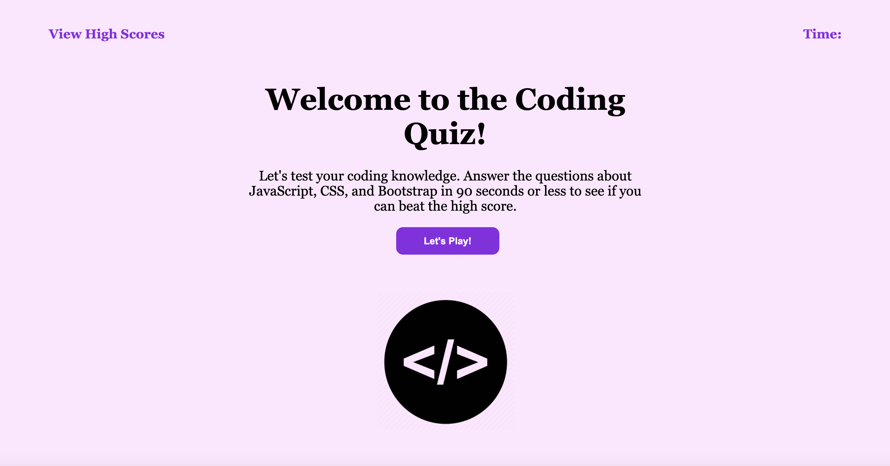
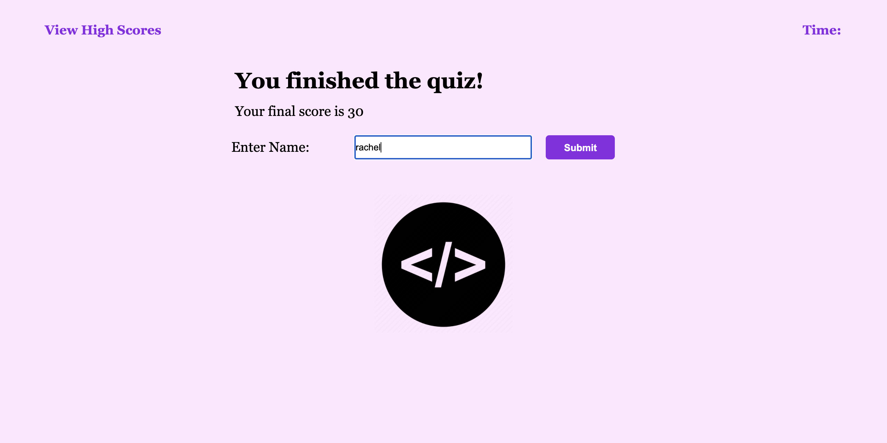

## Code Quiz

## Link to Deployed Assets 
https://racheldmarron.github.io/Java-Code-Quiz/ 

## Overview

This project was to create an interactive code quiz using HTML, CSS, and JavaScript. The code quiz should have a clean, polished, and responsive UI.

## User Story

```
AS A coding boot camp student
I WANT to take a timed quiz on JavaScript fundamentals that stores high scores
SO THAT I can gauge my progress compared to my peers
```HAT I can create a strong password that provides greater security
```

## Acceptance Criteria

```
GIVEN I am taking a code quiz
WHEN I click the start button
THEN a timer starts and I am presented with a question
WHEN I answer a question
THEN I am presented with another question
WHEN I answer a question incorrectly
THEN time is subtracted from the clock
WHEN all questions are answered or the timer reaches 0
THEN the game is over
WHEN the game is over
THEN I can save my initials and my score
```he password is either displayed in an alert or written to the page
```

## How This Was Acheieved
<ul><li>By using JavaScript, I was able to pass all acceptance criteria. The user should be able to click the START button and have the timer start. They will also be presented with Question 1.</li>
<li>As the user answers questions, the next question appears.</li>
<li>If a user gets the question wrong, time is subtracted from the clock.</li>
<li>When the game is over, the user can record their name and score.</li>
<li>The user can view questions they got right or wrong in the Console. Their scores will be saved in Local Storage.</li></ul>

## Visual Representations





- - -
© 2021 Rachel Delaney Marron, Inc. All Rights Reserved.